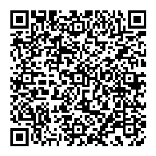

# OTP

[](https://github.com/huk10/go-otp/actions)
[](https://github.com/huk10/go-otp/blob/master/LICENSE)
[](https://pkg.go.dev/github.com/huk10/go-otp)

[](https://github.com/huk10/go-otp/releases)

This is a Golang OTP library compatible with google-authenticator APP.

## Installation

```shell
$ go get github.com/huk10/go-otp
```

## Usage

Check API docs at https://godoc.org/github.com/huk10/go-otp

### Time-based OTPs

```go
secret := otp.Base32Encode(otp.RandomSecret(20))
totp := otp.NewTOTP(secret)

// Get the token of the current time
_ = totp.Now()

// Get the token for the specified time
token := totp.At(time.Unix(1704075000000, 0))

// otp verify
totp.Verify(token,  time.Unix(1704075000000, 0))

// get qrcode 
png, err := totp.KeyURI("alice@google.com", "Example").QRCode()
if err != nil {
    panic(err)
}
// qrcode write to a file
err = os.WriteFile("./qrcode.png", png, 0666)

// get uri
_ = totp.KeyURI("alice@google.com", "Example").URI().String()
```

### Counter-based OTPs

```go
secret := otp.Base32Encode(otp.RandomSecret(20))
hotp := otp.NewHOTP(secret)

// Get the token corresponding to counter 1
token := hotp.At(1)

// otp verify
hotp.Verify(token, 1)

// get qrcode 
png, err := hotp.KeyURI("alice@google.com", "Example").QRCode()
if err != nil {
    panic(err)
}
// qrcode write to a file
err = os.WriteFile("./qrcode.png", png, 0666)

// get uri
_ = hotp.KeyURI("alice@google.com", "Example").URI().String()
```

### Generate random secret

```go
// generate a 20 byte random secret
secret := otp.RandomSecret(20)
// base32 encode
str := otp.Base32Encode(secret)
```

### Google Authenticator Compatible

This library works with the Google Authenticator APP.

```Go
// secret 
secret := otp.Base32Encode(otp.RandomSecret(20))

// totp
otp.NewTOTP(secret).KeyURI("alice@google.com", "Example").URI().String()

// hotp
otp.NewHOTP(secret, otp.WithCounter(10)).KeyURI("alice@google.com", "Example").URI().String()
```

You can use the URI generated by the above code as the QR code content and use the Google Authenticator APP to scan the code and import it.

### Working example

Use Google Authenticator to scan the QR code below.



Now run the following and compare the output:

```go
package main

import (
	"fmt"
	"github.com/huk10/go-otp"
)

func main() {
	totp := otp.NewTOTP("J3W2XPZP5HDYXYRB4HS6ZLU6M6VBO6C6")
	token := totp.Now()
	fmt.Println("Current OTP is", token)
}
```

## Links

* [HOTP: An HMAC-Based One-Time Password Algorithm](https://datatracker.ietf.org/doc/html/rfc4226)
* [TOTP: Time-Based One-Time Password Algorithm](https://datatracker.ietf.org/doc/html/rfc6238)

## License

go-otp is licensed under the [MIT License](./LICENSE)

